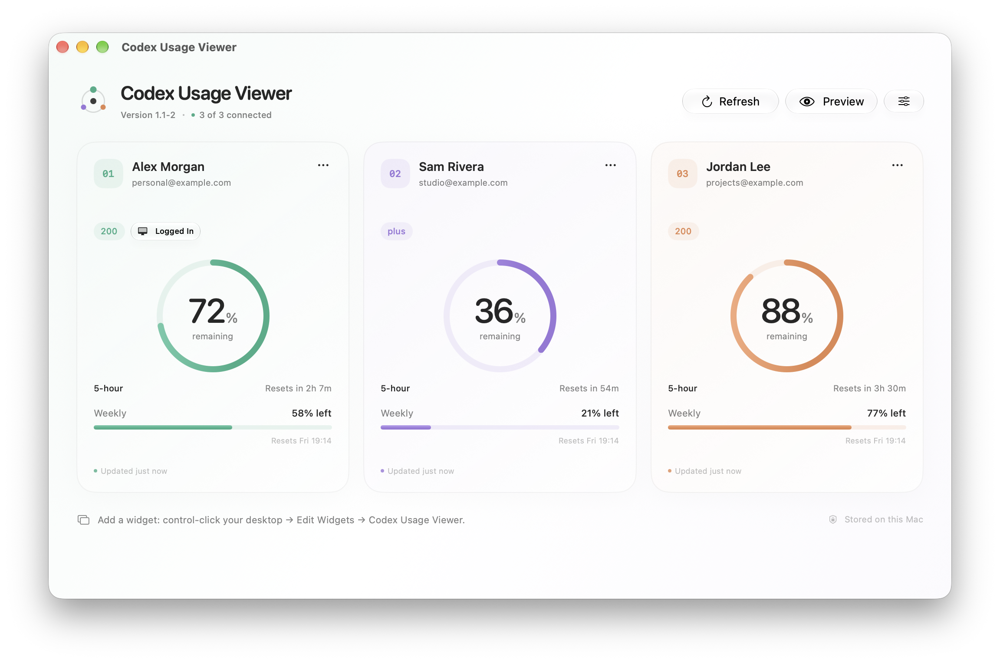
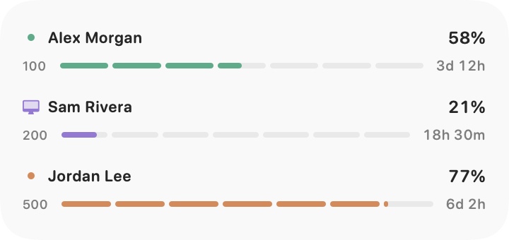

# Codex Usage Viewer

Native macOS app and desktop widgets for three Codex accounts. Shows remaining usage, reset times, and the account logged in to local Codex.

[Download](https://github.com/schneidermayer/codex-usage-viewer/releases/latest) · Requires macOS and a separately installed [Codex CLI](https://learn.chatgpt.com/docs/codex/cli).

<picture>
  <source media="(prefers-color-scheme: dark)" srcset="docs/images/dashboard-dark.png">
  
</picture>

<picture>
  <source media="(prefers-color-scheme: dark)" srcset="docs/images/widget-medium.png">
  
</picture>

*Sample accounts. Widget images are layout previews.*

## Setup

1. Unzip the download and move **Codex Usage Viewer.app** to Applications.
2. Connect each account using its Chrome profile, or copy the sign-in link into the correct browser profile.
3. Add **Codex Usage Viewer** from **Edit Widgets**.

If Codex is not detected, select its executable in Settings. If macOS blocks it, install a current official Codex CLI.

Keep the app running for updates. It refreshes every three minutes; macOS controls widget refresh timing. Data becomes stale after ten minutes. Missing or expired limits remain unknown.

Widget percentages show weekly usage remaining; bars and countdowns show time until reset. The computer icon identifies the default local Codex account. Subscription labels are Prolite → 100, Pro → 200, Promax → 500; other names are unchanged.

## Build and test

Requires Xcode with the macOS SDK. Configure your signing identity, team, and App Group for both targets in `CodexUsageViewer.xcodeproj`.

```sh
./scripts/build.sh
swift test
python3 scripts/test_version.py
./scripts/render_widgets.sh
xcodebuild -project CodexUsageViewer.xcodeproj -scheme CodexUsageViewer \
  -configuration Debug -derivedDataPath build -destination 'platform=macOS' test
```

App output: `build/Build/Products/Release/Codex Usage Viewer.app`.

Tests use synthetic accounts. Widget renders check content layout; desktop hosting and refresh timing need separate checks.

After adding source files, regenerate the project with `ruby scripts/generate_project.rb` (requires the `xcodeproj` Ruby gem).

## Releases

Update `VERSION` and `docs/releases/<version>.md`, validate, and commit with a clean working tree:

```sh
release_version=$(cat VERSION)
NOTARY_PROFILE=your-keychain-profile \
  python3 scripts/release.py "$release_version" --notes "docs/releases/$release_version.md"
```

The script creates an annotated numeric tag, builds for Apple silicon and Intel, signs and notarizes the app, and publishes a ZIP and checksum. Releases display the version alone; development builds append commits since the release tag. Never move a published tag.

## Local data

Each account stores credentials privately under `~/Library/Application Support/CodexUsageViewer/Accounts/account-{1,2,3}`. Never share or commit these files. Widgets receive account metadata and usage, without tokens. Chrome cookies are not read.

The app reads limits through [Codex app-server](https://learn.chatgpt.com/docs/app-server#auth-endpoints), without inference requests. It checks the default `~/.codex` identity through read-only `account/read`; it does not change that login. Full names come from app-owned logins, with email fallback.
