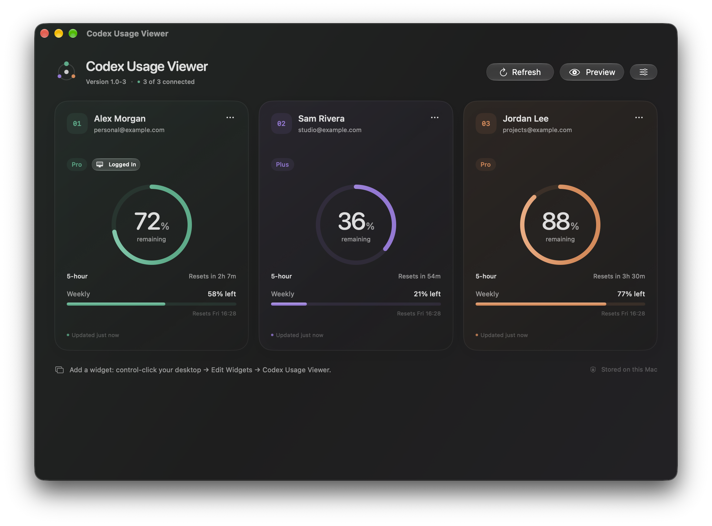
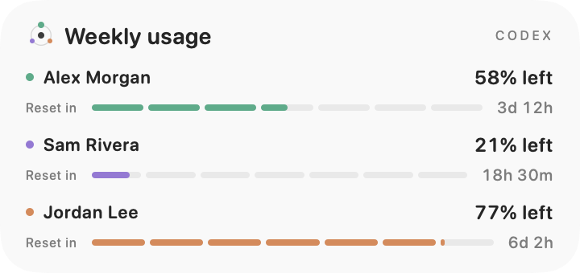

# Codex Usage Viewer

Your Codex accounts, a glance away.



The dashboard image uses synthetic test accounts in a development build.

Repository: [`schneidermayer/codex-usage-viewer`](https://github.com/schneidermayer/codex-usage-viewer).

Codex Usage Viewer is a native macOS 27 app with a Liquid Glass interface and desktop widgets. It brings three independently signed-in ChatGPT accounts into one view, showing Codex usage remaining, quota windows, and reset times with quiet mint, lilac, and apricot accents.

- Three separate account connections, identified by their full account names.
- A **Logged In** badge identifies the account currently used by local Codex.
- Remaining usage and window labels taken from Codex’s account data.
- Small, medium, and large widgets showing all three accounts, weekly usage remaining, and a seven-day reset bar with a numeric countdown.
- Subscription type remains visible alongside the **Logged In** badge.
- No menu bar tray icon. The main window and standard application Quit command show the build version.
- Clear disconnected, unavailable, and out-of-date states. A reset time passing never proves that an allowance has recovered.
- A clearly labeled preview mode for exploring the interface with sample accounts.



The widget image is a fixture render of the real widget views; it does not depict your accounts or prove native widget-host execution.

## Requirements

- macOS 27 or later.
- An installed, recent **Codex CLI** with the `app-server` account methods. The app uses that local executable; it does not bundle or install Codex.
- A ChatGPT account with Codex access for each connection.
- To build: Xcode with the macOS 27 SDK and a signing identity that can sign the app and its widget extension for the same team and App Group.

See the [official Codex documentation](https://learn.chatgpt.com/docs/app-server) for the local app-server integration and [authentication options](https://learn.chatgpt.com/docs/auth).

Automatic detection respects your configured executable and `PATH`, then checks common installation locations. For nvm installations, it compares the installed **Codex package versions**, independently of Node versions. Incomplete npm installations whose native executable is missing are skipped without running them.

If macOS blocks a Codex executable, leave the blocked copy in the Bin and install a current copy from the [official Codex CLI instructions](https://learn.chatgpt.com/docs/codex/cli). Select that installation in Settings if needed. The viewer does not disable Gatekeeper, remove quarantine attributes, or restore blocked executables.

## Connect your accounts

1. Open Codex Usage Viewer. If Codex is not detected, open **Settings** and choose the installed `codex` executable.
2. Select **Connect account**, then choose the matching **Chrome profile**.
3. Click **Open in Chrome** and complete the OpenAI sign-in flow. Alternatively, use **Copy sign-in link** and paste it into a new tab in the intended browser profile.
4. Return to the app and check the displayed email. Repeat for the other two accounts, using their matching browser profiles.
5. Add **Codex Usage Viewer** from macOS’s widget gallery to your desktop or Notification Center.

Chrome profile names are discovered from Chrome’s local profile index. The app does not scrape browser pages or read browser cookies. **Open browser**, offered if no Chrome profiles are found, uses your default browser. After connecting, Codex manages the stored login and token refresh for that account.

Keep the app running for fresh usage; closing its dashboard leaves it running, and you can reopen it from the Dock. There is no menu bar tray icon. The app checks connected accounts every three minutes. Widgets read the last shared snapshot and request a new timeline every 15 minutes; macOS controls their actual refresh timing. Widget data becomes out of date after ten minutes without a successful account update. [Apple’s widget refresh documentation](https://developer.apple.com/documentation/widgetkit/keeping-a-widget-up-to-date) explains the scheduling limits.

The **Logged In** badge compares connected-account emails with the identity returned by the installed Codex CLI using its normal `~/.codex` authentication context. It checks automatically and on **Refresh**. This lookup uses `account/read` with token refresh disabled; it never signs in, signs out, or changes the active account. A custom Codex home used by another terminal is outside this default-home check. Missing, unmatched, or stale identity is shown without guessing a badge.

## Download

Download the signed, notarized app from [GitHub Releases](https://github.com/schneidermayer/codex-usage-viewer/releases/latest), unzip it, and move **Codex Usage Viewer.app** to `/Applications`. Codex CLI is installed separately.

## Versions and releases

`VERSION` contains the current release number. Every Xcode build, including builds from the IDE, calculates `<current version>-<commits since the nearest reachable numeric release tag>`. Release **1.0** is tagged `1.0` and displays **1.0-0**; the next commit displays **1.0-1**. The app and widget embed the same version metadata. Apple bundle fields remain numeric.

To publish a release, update `VERSION` and its notes, validate the UI, and commit the changes. Then run:

```sh
NOTARY_PROFILE=your-notarytool-keychain-profile \
  python3 scripts/release.py 1.0 --notes docs/releases/1.0.md
```

The release script creates the annotated numeric Git tag before building, runs Swift and versioning tests, builds for Apple silicon and Intel, signs/notarizes/staples the app, checks Gatekeeper, and publishes a ZIP plus SHA-256 checksum to GitHub Releases. A failed notarization stops publication. Existing tags are never moved to a different commit.

## Build and test

Open `CodexUsageViewer.xcodeproj`, select the **CodexUsageViewer** scheme, and choose your signing team and identity. The widget is embedded in the app automatically.

Alternatively, build from the repository root:

```sh
./scripts/build.sh
```

The project contains the maintainer’s signing settings. Override them for your certificate when needed:

```sh
./scripts/build.sh \
  DEVELOPMENT_TEAM=YOUR_TEAM_ID \
  CODE_SIGN_IDENTITY="Developer ID Application: Your Name (YOUR_TEAM_ID)"
```

The built app is written to `build/Build/Products/Release/Codex Usage Viewer.app`. Both targets derive their App Group identifier from the selected development team; a valid signing configuration is required for sharing snapshots and registering the widget. Copy the app to `/Applications`, open it, and find **Codex Usage Viewer** in **Edit Widgets**.

Run the model and local protocol tests with:

```sh
swift test
```

Run native pointer and keyboard tests:

```sh
xcodebuild -project CodexUsageViewer.xcodeproj -scheme CodexUsageViewer \
  -configuration Debug -derivedDataPath build -destination 'platform=macOS' test
```

Render every widget size in light and dark appearances with clearly documented fixtures:

```sh
./scripts/render_widgets.sh
```

Widget renders verify content layout; they do not substitute for testing inside the macOS widget host. To regenerate the Xcode project after adding source files, run `ruby scripts/generate_project.rb` (requires the `xcodeproj` Ruby gem).

The tests use temporary fake Codex processes and fixture responses. They do not sign in to your accounts or query live usage. To explore the interface without connecting accounts, use **Preview** in Codex Usage Viewer.

## Privacy and local storage

The app has no hosted backend. Its local Codex workers communicate with OpenAI using the documented account methods; the app never starts model conversations or sends inference requests.

Each slot uses a separate `CODEX_HOME` beneath:

```text
~/Library/Application Support/CodexUsageViewer/Accounts/account-1
~/Library/Application Support/CodexUsageViewer/Accounts/account-2
~/Library/Application Support/CodexUsageViewer/Accounts/account-3
```

Account directories are restricted to the current user with mode `0700`. The app explicitly selects Codex’s file credential store, so credentials remain in these private directories rather than the widget’s App Group or the normal `~/.codex` login. Codex manages its own `auth.json`; treat it as a password and never commit or share it.

Full account names are read in-process from the profile claim in each app-owned Codex login, only when its email matches the official account identity. Names are display metadata, not authentication evidence. No token is copied or logged; the normal `~/.codex` login is never read for profile names. If the name is unavailable, the account email is shown.

The widget receives only a local snapshot of account names, email/plan metadata, usage, timestamps, and status. The snapshot is written with mode `0600`; it contains no sign-in tokens. Preview data stays in memory and is never saved to the widget snapshot. Credentials, logs, and build output are excluded from version control.

## Current scope

The app displays **Codex account limits**, not API billing or every ChatGPT model’s message allowance. Available windows and extra limit buckets depend on the account and the installed Codex version. The app-server interface can change, so keeping Codex current may be necessary.

WidgetKit scheduling prevents a guaranteed live display, and the companion app must remain running to fetch new data. The app does not currently register itself to launch at login.

Connecting accounts requires interactive Chrome sign-in. Local identity and full-name reads were checked without printing account details or changing the normal Codex auth/config files. Native widget-host rendering and desktop refresh scheduling remain separate from fixture-render validation.

## Validation

- Native macOS 27 Release app and embedded WidgetKit extension build and pass strict code-signature verification.
- 68 Swift tests cover account full names, weekly reset calculations, executable discovery, incomplete npm installations, protocol framing, errors/timeouts, isolated credentials, Chrome profiles, login/cancel/disconnect races, snapshot privacy, missing/expired limits, and local-account badge changes.
- Native pointer/keyboard checks cover full names, simultaneous plan and Logged In badges, settings, preview mode, all-limits details, and the versioned Quit command.
- 24 documented widget fixture renders cover small/medium/large, light/dark, disconnected/connected/stale, and the **Logged In** badge.
- The extension registers with PlugInKit and appears in Apple’s native WidgetKit Simulator chooser. Provider rendering inside that host and desktop refresh scheduling have not been verified.

## References

- [Codex app-server account and rate-limit methods](https://learn.chatgpt.com/docs/app-server#auth-endpoints)
- [Codex authentication and credential storage](https://learn.chatgpt.com/docs/auth#credential-storage)
- [`CODEX_HOME` and supported environment variables](https://learn.chatgpt.com/docs/config-file/environment-variables)
- [WidgetKit on macOS](https://developer.apple.com/documentation/widgetkit/widgets-and-complications-collection)
- [Keeping widgets up to date](https://developer.apple.com/documentation/widgetkit/keeping-a-widget-up-to-date)
