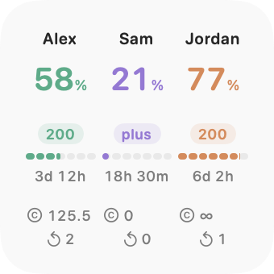
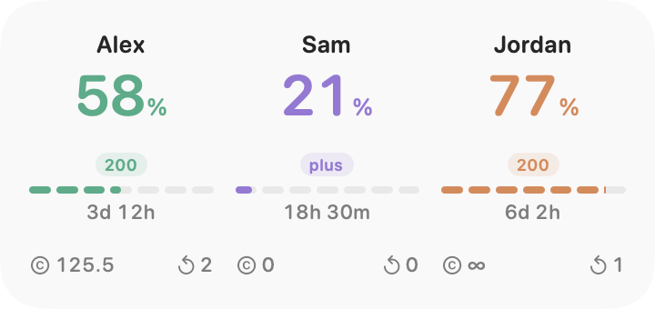

# Codex Usage Viewer

Native macOS app and widgets for three Codex accounts: usage remaining, reset countdowns, credits, earned resets, and local account status.

[Download](https://github.com/schneidermayer/codex-usage-viewer/releases/latest) · Requires macOS 27+ and [Codex CLI](https://learn.chatgpt.com/docs/codex/cli). This README describes the current source; [release notes](https://github.com/schneidermayer/codex-usage-viewer/releases) describe published builds.

<picture>
  <source media="(prefers-color-scheme: dark)" srcset="docs/images/widget-small.png">
  
</picture>
<picture>
  <source media="(prefers-color-scheme: dark)" srcset="docs/images/widget-large.png">
  
</picture>

*Layout previews with sample accounts.*

## Setup

1. Unzip the download and move the app to Applications.
2. Connect accounts through their Chrome profiles, or open each sign-in link in the appropriate browser profile.
3. In **Edit Widgets**, add **Small** (square) or **Large** (wide).

Select the Codex executable in Settings if detection fails.

A login helper refreshes every three minutes, including after quitting. Allow or disable it in **System Settings → General → Login Items & Extensions**; connection status appears in app Settings. macOS controls widget refresh timing.

Widgets show three account columns with first names and weekly usage remaining; bars and countdowns track the automatic reset. The computer marks the local account; Ⓒ marks credits and ↶ earned resets. Earned resets are separate from automatic resets. Prolite/Pro/Promax display as 100/200/500; other names remain unchanged.

Missing data, expired limits, and data older than ten minutes are unknown. Widgets use compact resource values, — for unknown, and ∞ for unlimited credits; full identities and exact values remain available to accessibility and in tooltips. A reset timestamp never proves quota recovery.

## Build and test

Requires Xcode. Configure signing, team, and App Group for the app, helper, and widget in `CodexUsageViewer.xcodeproj`.

```sh
./scripts/build.sh
swift test
python3 scripts/test_version.py
./scripts/render_widgets.sh
xcodebuild -project CodexUsageViewer.xcodeproj -scheme CodexUsageViewer \
  -configuration Debug -derivedDataPath build -destination 'platform=macOS' test
```

Output: `build/Build/Products/Release/Codex Usage Viewer.app`.

Tests and renders use fixtures; verify live accounts and desktop widget hosting separately.

After adding sources, run `ruby scripts/generate_project.rb` (requires the `xcodeproj` gem).

## Releases

Update `VERSION` and `docs/releases/<version>.md`, validate, and commit. From a clean tree:

```sh
release_version=$(cat VERSION)
NOTARY_PROFILE=your-keychain-profile \
  python3 scripts/release.py "$release_version" --notes "docs/releases/$release_version.md"
```

Publishes a signed, notarized universal ZIP and checksum. Tagged builds display `VERSION`; development builds append commits since the nearest numeric release tag. Never move a published tag.

## Privacy

Credentials stay in private app-owned `CODEX_HOME` directories under `~/Library/Application Support/CodexUsageViewer/Accounts/account-{1,2,3}`. Never copy, log, or commit them. Widgets receive sanitized snapshots; Chrome cookies are not read.

Uses [Codex app-server](https://learn.chatgpt.com/docs/app-server#auth-endpoints) account methods without inference. The default local identity is read through `account/read`, without login, logout, or token refresh. Names come only from app-owned logins matched to the official account email, with email fallback.
